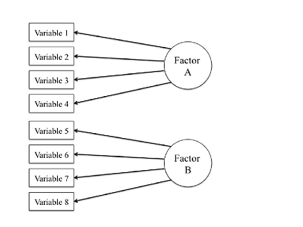

# What is this

####This is my portfolio. All of my school work was just sitting on my computer not benefitting me at all so I figured that I should put it to use. Hopefully this is a good way to show what I know how to do. Without further ado, here it is from newest to oldest: 

---

<table  border="5" bordercolor="black" align="center">
<colgroup>
<col width="20%" />
<col width="80%" />
</colgroup>

<thead>
<tr class="header">
<th align="center" >Midterm Election Predictions</th>
<th align="center" >Description</th>
</tr>
</thead>

<tbody>
<tr>
  <td><a href=midterm_project.html></img> </td>  
  <td> [Here](midterm_project.html) is the project. This project was really limited by our ability to find good data. We wanted to be able to make a prediction for each state but that kind of data is not readily available. The data I used was from 538 and was pretty general. One data set was the presidents approval rating and the other was support of either democrats or republicans for the midterm elections. I compared a linear model and a tree, but both methods came up with unrealistic results. More detailed data is absolutely necessary to make any kind of political predictions.  </td>
</td>
</tr>

</tbody>
</table>

---

<table  border="5" bordercolor="black" align="center">
<colgroup>
<col width="20%" />
<col width="80%" />
</colgroup>

<thead>
<tr class="header">
<th align="center" >Webscraping Project</th>
<th align="center" >Description</th>
</tr>
</thead>

<tbody>
<tr>
  <td><a href=webscraping_project.html></img> </td>  
  <td> [Here](webscraping_project.html) is the project. During DataFest 2018 I was trying really hard to think a way to bring in some outside data. We were given a data set about job searches so I wanted to see I a list of world events shaped influenced job searches. Once I found a data set that webscraped easily I focused completely on making a nice automated csv from it without actually looking at the events. Once it was all done and I was matching events to clicks on a certain day I found out that most of the events were ridiculous. One was a donkey being let of of jail. Still, I had fun doing this and learned to really look at what I'm webscraping first.  </td>
</td>
</tr>

</tbody>
</table>

---

<table  border="5" bordercolor="black" align="center">
<colgroup>
<col width="20%" />
<col width="80%" />
</colgroup>

<thead>
<tr class="header">
<th align="center" >DataFest Website</th>
<th align="center" >Description</th>
</tr>
</thead>

<tbody>
<tr>
  <td><a href=https://mborgert.github.io/datafest/></img> </td>  
  <td> [Here](https://mborgert.github.io/datafest/) is the project. This website was made for the first Chico State DataFest, which I also participated in. Even though I had made a website before I learned a lot from this one and used it as a template for this portfolio.  </td>
</td>
</tr>

</tbody>
</table>

---

<table  border="5" bordercolor="black" align="center">
<colgroup>
<col width="20%" />
<col width="80%" />
</colgroup>

<thead>
<tr class="header">
<th align="center" >Fake News Project</th>
<th align="center" >Description</th>
</tr>
</thead>

<tbody>
<tr>
  <td><a href=fake_news_project.html></img> </td>  
  <td> [Here](fake_news_project.html) is the project. For this project my team found a data set from PEW Research Center. It was a phone survey that asked questions such as how well someone feels they can identify fake news. Our goal was to determine if people's feelings about fake news were different due to their political ideology. We did this by creating a model that would predict their ideology based on their answers to the survey questions. We created an accurate model when trying to predict liberal vs conservative but not republican vs democrat.</td>
</td>
</tr>

</tbody>
</table>

---

<table  border="5" bordercolor="black" align="center">
<colgroup>
<col width="20%" />
<col width="80%" />
</colgroup>

<thead>
<tr class="header">
<th align="center" >Factor Analysis</th>
<th align="center" >Description</th>
</tr>
</thead>

<tbody>
<tr>
  <td><a href=conf_fact_project.html></img> </td>  
  <td> [Here](conf_fact_project.html) is the project. In this project we were given a data set where the researchers had an idea of how the variables would relate. These were nine factors about emotional health and our goal was to see if the variables would be grouped into these nine factors through confirmatory factor analysis. Only a couple were kind of close and the rest were far from it.  </td>
</td>
</tr>

</tbody>
</table>

---

<table  border="5" bordercolor="black" align="center">
<colgroup>
<col width="20%" />
<col width="80%" />
</colgroup>

<thead>
<tr class="header">
<th align="center" >Sentiment Analysis</th>
<th align="center" >Description</th>
</tr>
</thead>

<tbody>
<tr>
  <td><a href=https://mitchborgert.shinyapps.io/twittershiny/></img> </td>  
  <td> [Here](https://mitchborgert.shinyapps.io/twittershiny/) is the project. This shiny app takes an input of a twitter user and n number of tweets. It then scores them by comparing the words in the tweets to a list of negative and positive words. For every negative word, a tweet gets -1 and for every positive word it gets +1. For example, a tweet with a score of 3 would probably be positive. The majority of tweets get 0 as a score so those are omitted. I also created a walk through of how this app was created.  </td>
</td>
</tr>

</tbody>
</table>

---

<table  border="5" bordercolor="black" align="center">
<colgroup>
<col width="20%" />
<col width="80%" />
</colgroup>

<thead>
<tr class="header">
<th align="center" >Baseball Data Analysis</th>
<th align="center" >Description</th>
</tr>
</thead>

<tbody>
<tr>
  <td><a href=https://mborgert.github.io/EDA/></img> </td>  
  <td> [Here](https://mborgert.github.io/EDA/) is the project. In this project we wanted to see if, during the steroid era of baseball (roughly 1988-2003), hitters did not actually gain an advantage by being on steroids because the pitchers were also on steroids. We did this by comparing the on-base plus sluging (OPS) of the hitters with the earned run average (ERA) of the pitchers. The OPS is the sum of a statistic of how often a hitter reaches base and a statistic that measures the batting productivity of a hitter. The ERA is the mean of the earned runs given up by a pitcher. By looking at these statistics for players before and after the steroid era, we can see whether hitters did not actually gain an advantage. </td>
</td>
</tr>

</tbody>
</table>

---

<table  border="5" bordercolor="black" align="center">
<colgroup>
<col width="20%" />
<col width="80%" />
</colgroup>

<thead>
<tr class="header">
<th align="center" >Estimation of Trees</th>
<th align="center" >Description</th>
</tr>
</thead>

<tbody>
<tr>
  <td><a href=tree_project.html></img> </td>  
  <td> [Here](tree_project.html) is the project. The purpose of this experiment was to find to best realistic way to estimate the number of trees on two types of 1000x1000 meter plantations. One plantation had randomly distributed trees and the other had them distributed non-randomly. The area surveyed for each combination of plot size and sample number was always 50x50 meters. Data was collected for 1x1, 5x5, 10x10, and 25x25 plots. These plots were sampled 2500, 100, 25, and 4 times. Data was collected for plantations with 1000, 2500, and 3,000 trees. Unfortunately, I've lost the code file that created the data, but I at least still have the data.  </td>
</td>
</tr>

</tbody>
</table>

---

<table  border="5" bordercolor="black" align="center">
<colgroup>
<col width="20%" />
<col width="80%" />
</colgroup>

<thead>
<tr class="header">
<th align="center" >Keeping It Real Project</th>
<th align="center" >Description</th>
</tr>
</thead>

<tbody>
<tr>
  <td><a href=kir_project.html></img> </td>  
  <td> [Here](kir_project.html) is the project. This was my first project in my first applied statistics class. The Keeping It Real data set was provided by my professor. The project sought to help middle school and high school students understand that their peers weren't as sexually active as they believed. Our group was given the variable Hispanic/Latino (hl), perceptions of their friends (friends), and whether they had the intervention (inter).  </td>
</td>
</tr>

</tbody>
</table>

