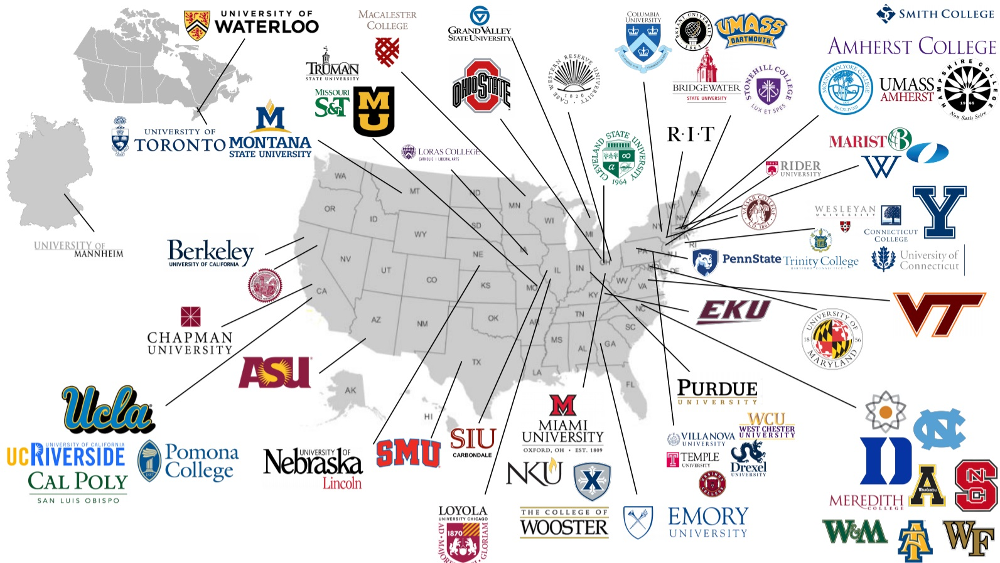
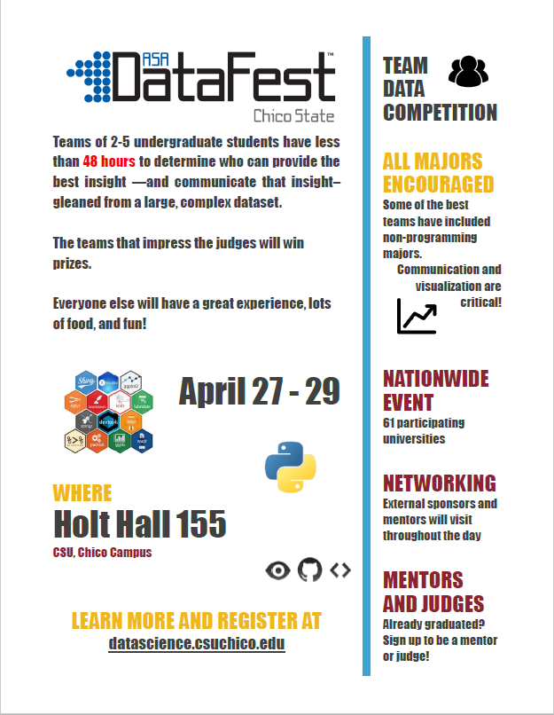

# About DataFest

DataFest is a nationally-coordinated undergraduate competition in which teams of up to 5 students work over a weekend to extract insight from a rich and complex data set. Previous years’ data sets have included crime data from the LAPD, dating data from eHarmony, and energy use data from GridPoint. This year’s data set will be revealed at the opening of the event on Friday evening. 

At the conclusion of the competition, each team will have 5 minutes and 2 slides to make a presentation to a panel of judges. Judges will select teams to win prizes for areas such as “Best Insight”, "Best Visualization", "Best use of external data", and one judges's personal favorite "Best Garbage Detection". 

The mission of DataFest is to expose undergraduate students to challenging questions with immediate real-world significance that can be addressed through data analysis. By working in teams, students with varying skill sets will combine their efforts and expand their collective data analysis horizons. Interaction among students, as well as with outside consultants will promote the sense that data analysis is a dynamic, engaging, and vibrant part of our society, as well as a realistic, practical, and fun career path.

#### Use the link in the navigation bar to register today!
* **Registration is now closed.**
* Interested in helping out at the event? Check out the **How to help** section on the [Faq](faq.html) page. 

---

## Where else is ASA DataFestTM happening?  
ASA DataFestTM is growing fast! It is being held at 61 institutions this year. If you are interested in holding ASA DataFestTM at your institution, visit the official [[ASA DataFest]](https://ww2.amstat.org/education/datafest/) webpage to get more information on the event.

---

  

