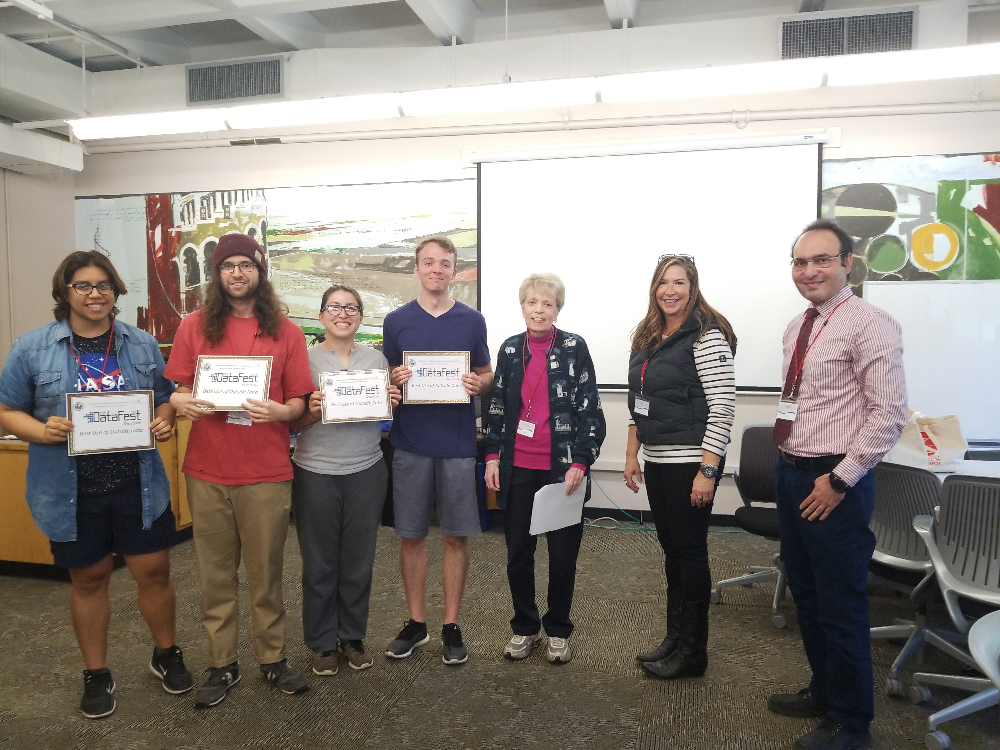
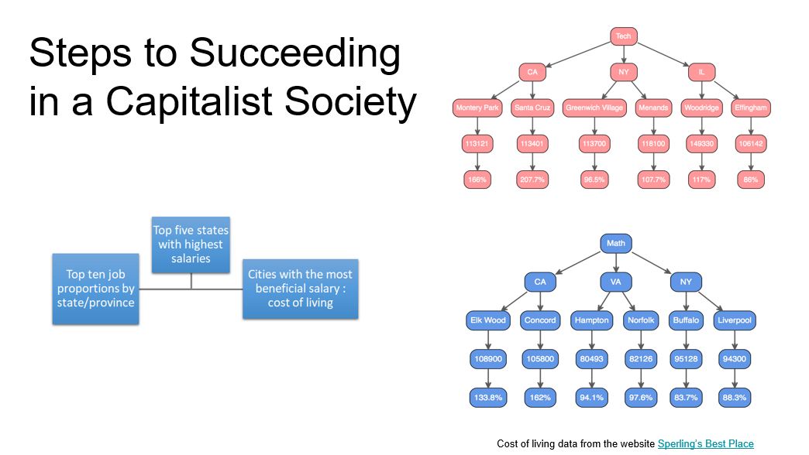
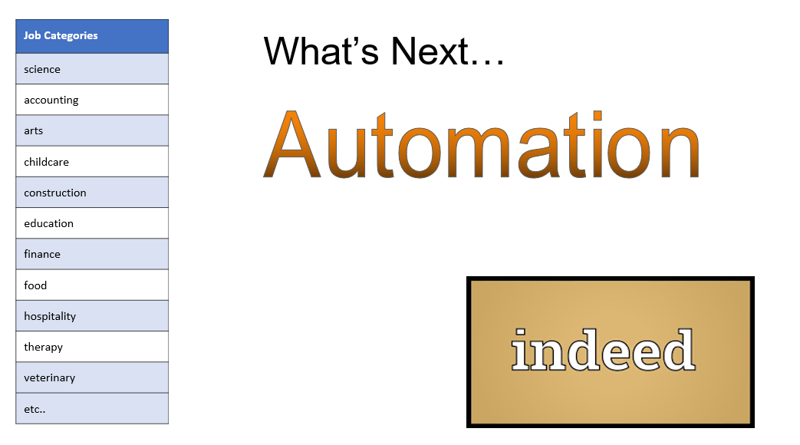
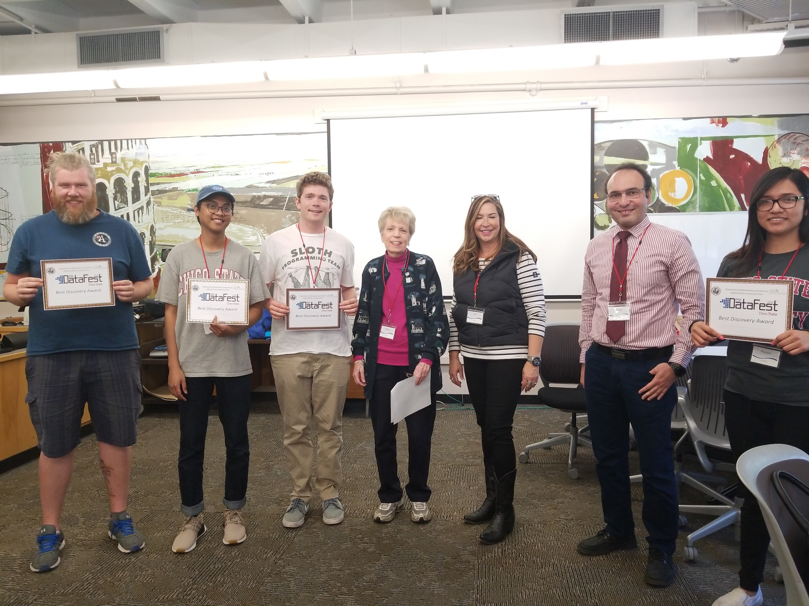
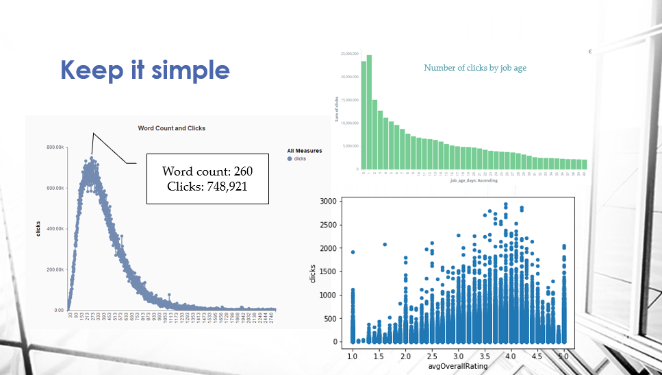
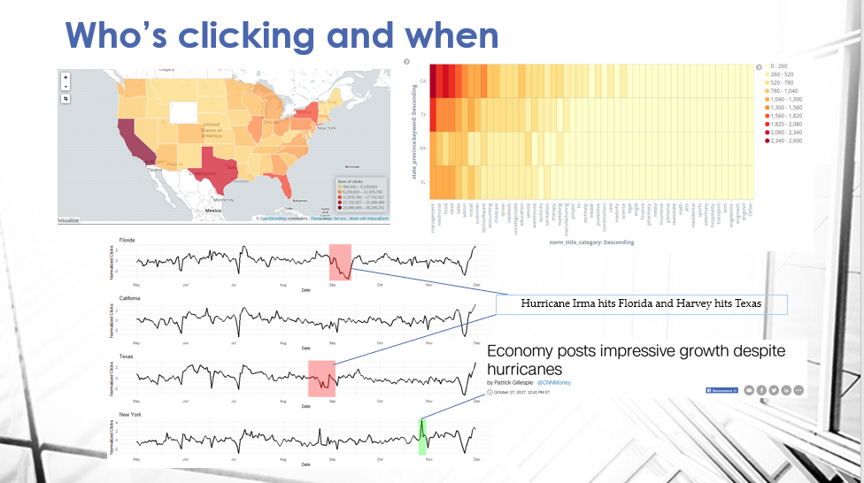

# Past Events:

## DataFest 2018
Our first year saw 12 undergraduate students from Applied Mathematics, Statistics, but also Computer Science, Construction Management, Civil Engineering, and Biology. The diversity of backgrounds and experiences was amazing. Many students were buzzing afterwards about how much fun they had and how much they learned that weekend.

After two days of intense data wrangling, analysis, presentation design, interspersed with a lot of good free food and caffeine, each team presented their findings to a panel of judges consisting of both on and off campus professionals. Over $500 worth of prizes were awarded for the following categories:

###Best Use of Outside Data
<table  border="5" bordercolor="black" align="center">
<colgroup>
<col width="50%" />
<col width="50%" />
</colgroup>

<thead>
<tr class="header">
<th align="center" >The Squadratics</th>
<th align="center" >Slides</th>
</tr>
</thead>

<tbody>
<tr>
  <td></img>  Eduardo Gomez, Jerry Tucay, Mariby Cruz, Mitch Borgert </td>  
  <td>   </td>
</td>
</tr>

</tbody>
</table>

###Best Visualization

<table  border="5" bordercolor="black" align="center">
<colgroup>
<col width="50%" />
<col width="50%" />
</colgroup>

<thead>
<tr class="header">
<th align="center" >Team Orange</th>
<th align="center" >Slides</th>
</tr>
</thead>

<tbody>
<tr>
  <td></img> Pedro Valdiva, Mike Mulligan, Grant Esparza, James Dittig </td>  
  <td>   </td>
</td>
</tr>

</tbody>
</table>

###Judges Choice and Best Discovery

<table  border="5" bordercolor="black" align="center">
<colgroup>
<col width="50%" />
<col width="50%" />
</colgroup>

<thead>
<tr class="header">
<th align="center" >Sloth Programming Team</th>
<th align="center" >Slides</th>
</tr>
</thead>

<tbody>
<tr>
  <td></img> Collin Deven, Eisley Adoremos, Ben Scanlan, Marisol Najera </td>  
  <td>   </td>
</td>
</tr>

</tbody>
</table>

