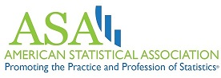
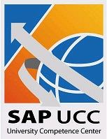
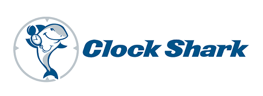

# Supporting Data Fest

As our event grows we will need more help from the North State Community to put this fabulous event on. 
How can you support DataFest at Chico State?

## Consider participating as a Visiting Consultant

Spend an hour or two getting to know the students and offering your sage advice. 
This is an excellent recruiting opportunity; you get to watch students working in teams, under pressure, striving to understand possibly the most complex data set they have encountered. 
At other institutions, students have received internships and interviews that have led to full-time employment. 
Success at DataFest requires that a team have a combination of computational, statistical, and human skills, as well as the ability to communicate clearly and extremely concisely.

[[Register here]](https://docs.google.com/forms/d/e/1FAIpQLSf6lrnab-gm-ds5xsi8Ss5j3E-ZTUc0ipSNQYOEvSzRbkoKhw/viewform) to sign up as a mentor, or contact Robin Donatello at rdonatello@csuchico.edu for more information. 

## Financial Contributions

We welcome financial donations from individuals and businesses. Donations are used to provide food, supplies, caffeine and prizes. Students can only work on this data while on site, so feeding them is critical! Contact Robin Donatello, rdonatello@csuchico.edu for more information on how to give. 

## Swag, giveaways, Prizes!!!

Pens, note pads, USB drives, buttons... Students love these and they help make the event fun. If we get something special, we can give it away in a “midnight raffle” to help keep the energy level high.

---

# 2018 Sponsors

Data Fest wouldn't be able to happen without the help of these individuals and companies. 

<table  border="5" bordercolor="black" align="center">
<colgroup>
<col width="30%" />
<col width="40%" />
<col width="40%" />
</colgroup>

<thead>
<tr class="header">
<th align="center" >Sponsor</th>
<th align="center" >Information</th>
<th align="center" >Website</th>
</tr>
</thead>

<tbody>
<tr>
  <td align="center" markdown="span"></img></td>  
  <td> CSU, Chico Provost & Vice President for Academic Affairs  
       College of Engineering, Computer Science & Construction Management (ECC)</td>
  <td>http://www.csuchico.edu/vpaa/    
      http://www.csuchico.edu/ecc/ </td>
</td>
</tr>

<tr>
  <td></img></td>  
  <td> The American Statistical Association is the National coordinating organization. 
  They work hard to get the most interesting data possible. </td>
  <td>https://www.amstat.org/ </td>
</td>
</tr>

</tbody>
</table>

* **[SAP University Competence Center (SAP-UCC)](http://sap.cob.csuchico.edu/)**        

* **[CESR (Center for Enterprise Systems and Informatics Research)](http://www.csuchico.edu/cob/students/beyond-classroom/cesir.shtml)** 

* **[Build.com](https://www.build.com/)**   
 

* **[Chico State Math Club](https://www.facebook.com/CSUChicoMathClub/)**   
 

* **[Payless Building Supply](http://www.paylessbuildingsupply.com/)**  

* **[Clock Shark](https://www.clockshark.com/)**  

* **[Data Camp](https://www.datacamp.com/promo/meetup)** is offering a free one-month trial membership (access to all their courses) for DataFest participants.
  

